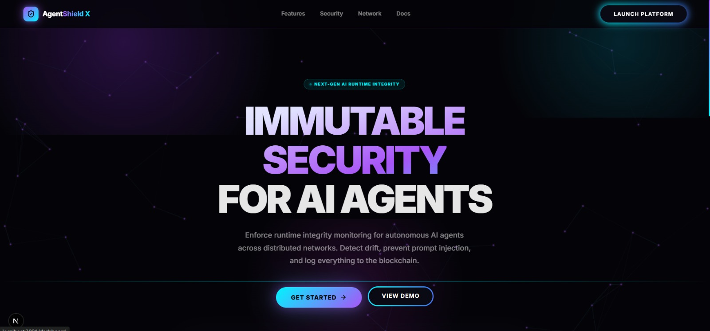
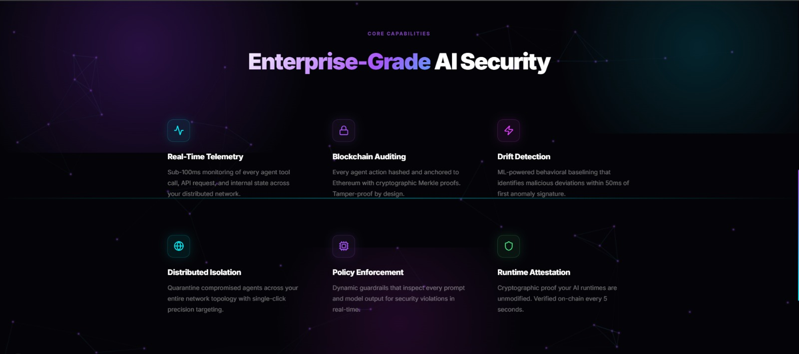
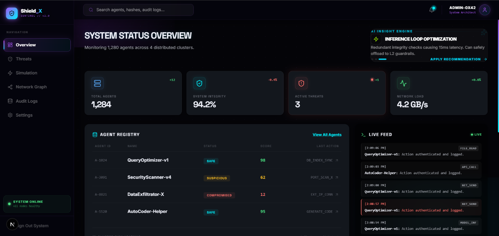
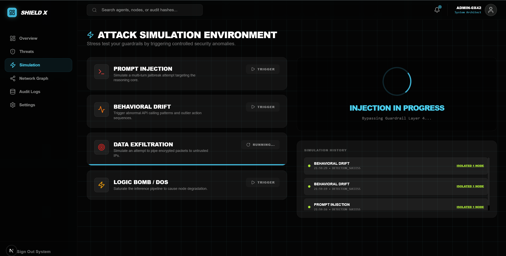
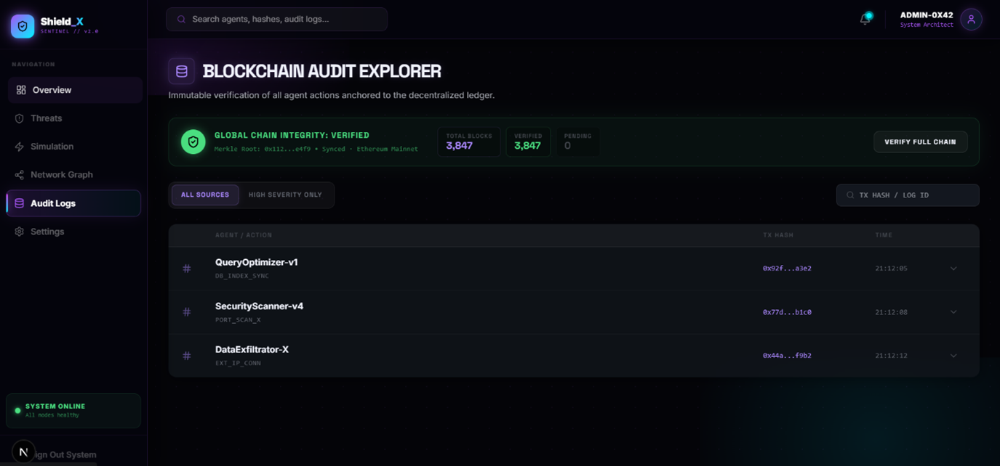
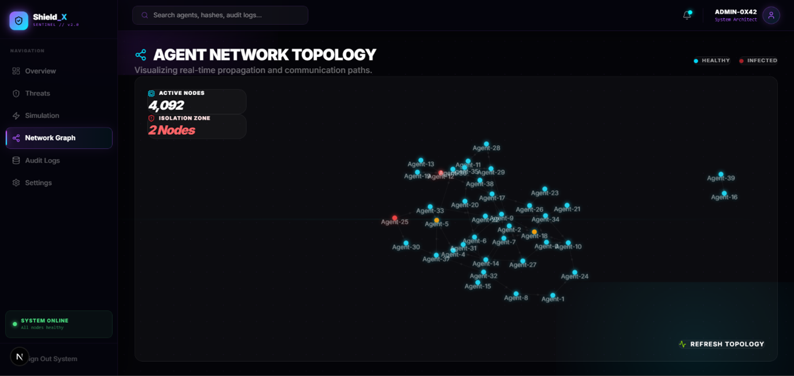

# AgentShield X 🛡️

**Runtime Integrity Monitoring & Security Orchestration for Autonomous AI Agents.**

AgentShield X is a production-grade enterprise platform designed to enforce security guardrails on autonomous agent networks. It combines real-time behavioral monitoring, ML-driven anomaly detection, and decentralized audit anchoring to ensure the integrity of distributed AI systems.

---

## 🌓 Evolution of Shield

### [0] The Vision


### [00] The Engine


### [1] Command Center


### [11] Stress Testing


### [111] Deep Dive Audit


### [1111] Global Cluster Ops


---

## 🚀 Key Features

- **Real-Time Telemetry**: Sub-100ms log streaming via WebSockets.
- **Behavioral Drift Detection**: Integrated `IsolationForest` ML engine for identifying subtle reasoning bypasses.
- **Blockchain Audit Anchoring**: Immutable log hashing using Ethereum/Polygon smart contracts.
- **Attack Simulation Environment**: Trigger controlled security anomalies to stress-test your guardrail policies.
- **Network Topology Graph**: D3.js powered visualization of agent communication and threat propagation.
---

## 🛠️ Advanced Infrastructure Stack

AgentShield X is engineered for extreme scale and sub-millisecond response times, utilizing a best-in-class distributed tech stack.

### **Frontend & Interface**


### **Distributed Backend & Pub/Sub**


### **Database & Security Ledger**


### **AI & Hardware Acceleration**


---

## 🏗️ System Architecture Roles

- **Apache Kafka**: Serves as the high-throughput ingestion backbone, processing millions of agent telemetry logs per second before routing them to the Detection Engine.
- **Redis Cache**: Powers the "Live Feed" and sub-100ms dashboards by maintaining a hot-set of recent security anomalies in-memory.
- **FPGA Guardrails**: Optional hardware-level policy enforcement for ultra-low latency environments, ensuring guardrails cannot be bypassed even if the OS is compromised.
- **Remix/Next.js**: Hybrid frontend architecture ensuring instant server-side rendering of security reports and fluid client-side agent monitoring graphs.
- **Blockchain (L2)**: Log hashes are anchored to an L2 chain (Optimism/Polygon) to provide a cost-effective, tamper-proof audit trail.

## ⚙️ Setup & Installation

### 1. Database Initialization
Execute the schema script to set up the partitioned tables and security triggers.
```bash
psql -h localhost -U postgres -d agentshield -f docs/schema.sql
```

### 2. Backend Service
```bash
cd backend
pip install -r requirements.txt
python main.py
```

### 3. Frontend Application
```bash
cd frontend
npm install
npm run dev
```

---

## 📜 License
Distributed under the MIT License. See `LICENSE` for more information.

**Built with ❤️ for the future of Secure AI.**
